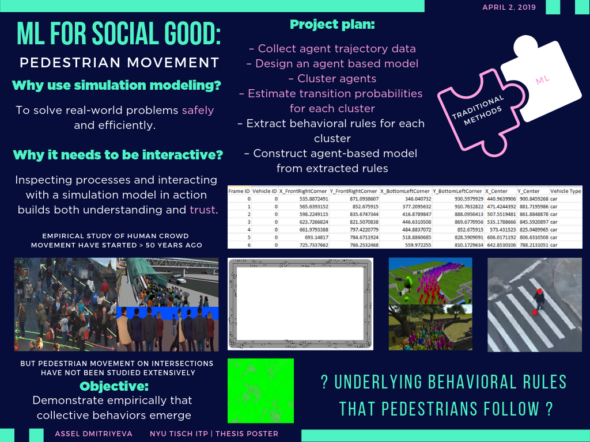

# Final Project Proposal

## Scenario

Simulation modeling of pedestrian movement can solve real-world problems safely and efficiently. Inspecting processes and interacting with  simulation model in action builds both understanding and trust. 
Empirical study of human crowd behaviour have started over 50 years ago. But building a model by obtaining patterns from the crowd movement requires big amounts of primary data. With the rise of Machine learning techniques, one can overcome these difficulties, using a relatively small training data set to identify patterns.

## Problem type

Using unsupervised learning techniques, simulated agents can learn and adjust their behaviours without knowing the scenario’s layout, based in learnt patterns around environment features.

Given that IRL not only allows to train agents into achieving concrete goals like crossing intersection, it can also learn different behavior patterns. It opens up possiblity of simulating real-life scenarios based on primary data (trajectories extracted from video recording of the streets in urban areas).

## Learning

Currently existing behavior cognitive models for pedestrians are very specific to the domain, not scalable and assume the reward or utility functions as a given. But in complex scenatios, like intersection crossing, agent's utility function is often unknown. To solve this problem, it is reasonable to use Inverse Reinforcement Learning (IRL). IRL methods work on cases when the reward function is hidden. Therefore, it is ideal for modeling humans behavior. Given that we do not have much information about the solution space in urban environments, maximum entropy approach should perform well. 

IRL techniques work on domains that can be modeled by a Markov decision process (MDP). MDP are defined by a tuple M = {S, A, T , γ, r}, where: 
* S - state space of the model
* A - set of actions that can be performed
* T - transition function
* r - reward function that generates a reward value from reaching a state. 

In order to get r, we need to use a set of expert trajectories T, consisting of “paths” composed of pairs of states and actions.

## Architecture

Our goal is to create MDP based on the simulated scenario and train the agents with expert trajectories. First we need to convert an input map so that MDP can use it. Map converter needs to translate map nodes into states, and possible action space for each link. Once we have the MDP model for the map, we can run IRL model. Expected output of IRL is the optimal policy function derived from the reward function. This policy function then can be used in a traditional agent-based models.
